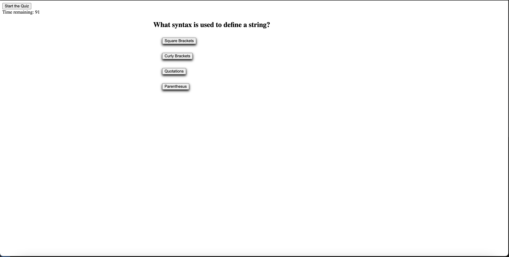

# <JS arcade>

## Description

Build this tool to practice the skills i have just learned. Ran into a lot of problems duplicating event listeners, restarting the game without refreshing the page, and properly displaying top scores. 

The quiz now properly tracks the amount of questions you answered correctly and time left when you were done, adding two together for competitive nature

## Table of Contents

- [Installation](#installation)
- [Usage](#usage)
- [Credits](#credits)
- [License](#license)

## Installation

No installation required, page is already live

## Usage

Just press the "Start Game" button to start the quiz. If you want to replay the game again just press "Play Again" button

## Credits

Wikipedia for the Fisher–Yates shuffle [https://en.wikipedia.org/wiki/Fisher%E2%80%93Yates_shuffle]

## License

Standard MIT license

---
